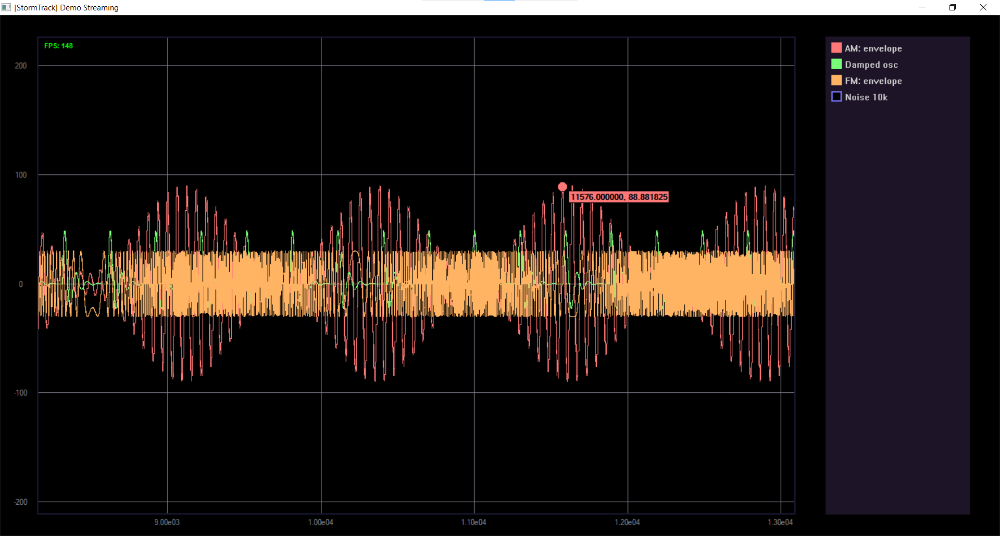
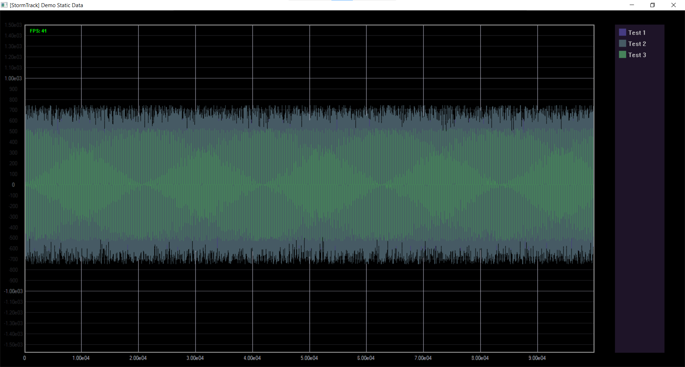

# StormTrack

**StormTrack** — WinApi GDI библиотека для отображения графиков в реальном времени на Windows с использованием GDI. Позволяет строить статические и потоковые данные, поддерживает масштабирование, панорамирование, автоскейлинг по X, отслеживание ближайшей точки, легенду и адаптивную сетку. Окно выполняется в отдельном потоке, оставляя консоль отзывчивой.

 


## Основные возможности

- **Несколько графиков** в одном окне.
- **Потоковое обновление** - данные подгружаются циклически в реальном времени - стриминг
- **Статические данные** - средние выборки (1M+)
- **Масштабирование** колёсиком мыши (по XY или только по X при зажатом Shift); масштабирование относительно позиции курсора.
- **Панорамирование** (перетаскивание) левой кнопкой мыши в области графика.
- **Автоподгонка по X** - горячая клавиша `A` включает/выключает автоматическую подстройку видимой области под все активные графики.
- **Легенда** - список трейсов с возможностью скрытия/отображения (клик по цветному квадрату).
- **Отслеживание данных** - при наведении курсора на график подсвечивается ближайшая точка и отображаются её координаты.
- **Адаптивная сетка** с числовыми подписями.
- **Изменяемый размер области графика** - границы поля можно перетаскивать.
- **Многопоточность** - окно живёт в отдельном потоке, не блокируя основной поток консольного приложения.

## Требования

- Windows (любая версия с поддержкой GDI)
- Компилятор с поддержкой C++11 или новее (рекомендуется Visual Studio 2015+)
- Стандартные системные библиотеки: `kernel32`, `user32`, `gdi32`
- Без внешних зависимостей

## Сборка

Проект не содержит файлов CMake или makefile - все файлы `.cpp` и `.hpp` просто добавляются в проект Visual Studio.

1. Создайте новый проект консольного приложения в Visual Studio.
2. Добавьте все `.cpp` и `.hpp` файлы из репозитория в проект.
3. Убедитесь, что предкомпилированные заголовки отключены (или используйте пустой `stdafx.cpp`).
4. Соберите в режиме Release для максимальной производительности.

Готовый исполняемый файл будет запускаться из командной строки.

## Быстрый старт

### Статический график

```cpp
#include "WindowObject.hpp"

std::vector<double> data = // тут может быть что угодно ...

HINSTANCE hInstance = GetModuleHandle(nullptr);
WindowObject window(hInstance, L"Пример");
window.GetGraphState().AddData(data, L"Сигнал", RGB(70, 130, 90));
window.Show();

// ...

window.Close();
window.WaitForClose();
```

### Потоковое обновление

```cpp
#include "WindowObject.hpp"
WindowObject window(hInstance, L"Пример");
auto traceId = window.GetGraphState().CreateTrace(L"Сигнал", RGB(255,120,120), 1.0);
window.Show();

for (;;) {

    // меняем data ... 

    window.GetGraphState().StreamUpdate(data, traceId);
}
window.WaitForClose();
```

## Управление

| Действие | Управление |
|----------|------------|
| Масштабирование | Колёсико мыши. Обычно — одновременно по X и Y. С зажатым `Shift` — только по X. С зажатым `Ctrl` — быстрый зум. Масштаб меняется относительно положения курсора. |
| Перемещение (панорамирование) | Зажать левую кнопку мыши на области графика и тянуть. |
| Автомасштаб по X | Клавиша `A` (работает как переключатель). Когда включён, видимая область автоматически подстраивается под весь диапазон активных трэйсов по оси X. |
| Легенда (скрыть/показать трэйс) | Клик по цветному квадратику в правой части окна. Трэйс временно скрывается или снова отображается. |
| Отслеживание координат | Навести курсор на график — ближайшая точка данных подсвечивается, а рядом с указателем появляется подсказка с её координатами. |
| Изменение размера области графика | Подвести курсор к границе тёмной рамки (появится двусторонняя стрелка) и перетащить границу. Скрывает и разворачивает панель с легендой. |